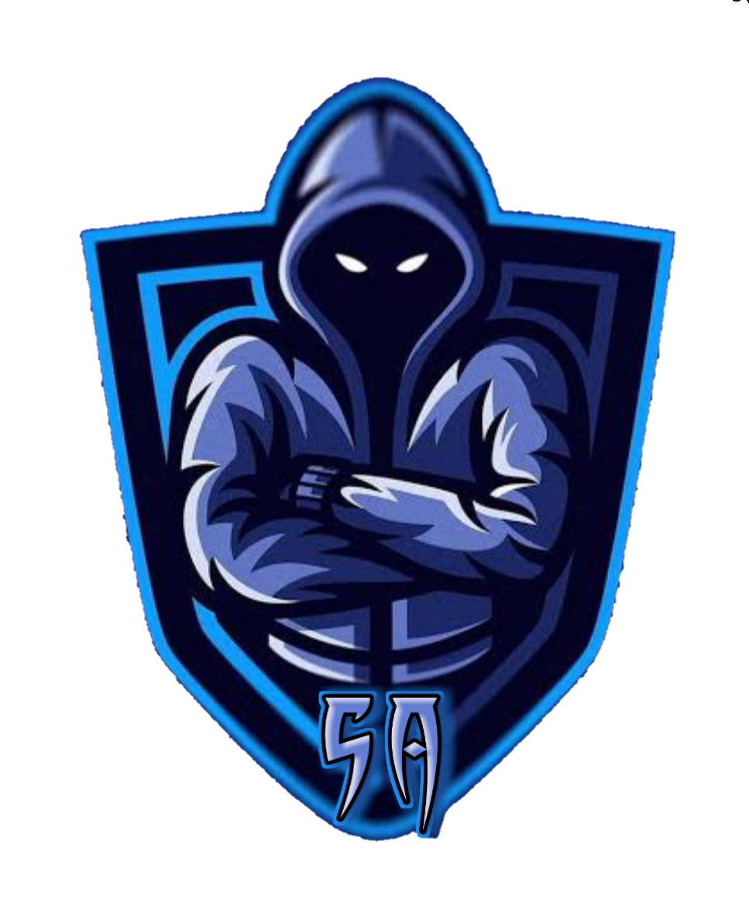

# QR Studio PRO - Professional Vector & Custom QR Generator

A modern, high-performance QR code studio built with vanilla JavaScript, CSS, and Python. Engineered for developers and designers who need production-ready vector QR codes compatible with **Figma**, **Canva**, and **Adobe Creative Cloud**.



---

## 🌟 Key Features

### 1. Vector Copy for Figma (As Native Frame)
- One-click **"Copy for Figma"** writes clean SVG XML directly to your system clipboard (`image/svg+xml` & `text/plain`).
- When pasted into **Figma** (`Ctrl+V` or `Cmd+V`), it immediately instantiates as an **editable Vector Frame** with structured layer groups (`QR-Modules`, `Finder-Eyes`, `Logo-Badge`, `Background`).
- Fully compatible with **Canva**, **Adobe Illustrator**, and **Photoshop**.

### 2. Studio Dashboard Layout
- Split-screen studio experience:
  - **Left Editing Panel**: Tabbed controls for Content, Design, Colors, Logo, and Settings.
  - **Right Live Preview Card**: Sticky real-time reactive SVG preview stage.

### 3. Three Distinct QR Module Designs
- **Classic Squares**: Crisp pixel-perfect square blocks.
- **Modern Dots**: Smooth circular dots.
- **Smooth Rounded**: Elegant rounded modules.

### 4. Custom Corner Finder Eyes
- Switch outer finder frame and pupil shapes between **Square**, **Smooth Rounded**, and **Circle**.
- Custom dedicated color pickers for outer frame and inner pupil.

### 5. Gradient & Color Controls
- Choose between **Solid Color** and **Linear Gradient** modes.
- Customize gradient start color, stop color, and angle slider (0° to 360°).
- Solid or transparent background support.

### 6. Logo Upload with Safety Cutout
- Drag-and-drop or browse custom logos (PNG, SVG, JPG, WebP).
- Scale slider (12% to 25%).
- Logo badge background mask: **Circle**, **Square**, or **None**.
- **Scannability Guardrail**: Automatically elevates error correction to **Level H (30%)** when a logo is embedded to ensure camera readability.

### 7. Precision & Error Correction
- Choose between 4 error correction levels:
  - **Low (L - 7%)**: Highest density.
  - **Medium (M - 15%)**: Balanced default.
  - **Quartile (Q - 25%)**: Higher fault tolerance.
  - **High (H - 30%)**: Maximum safety for logos and physical prints.
- Adjustable resolution export: 360px, 500px, 1000px, 2000px.
- Quiet zone padding margin slider (1 to 6 modules).

### 8. Multi-Format Exporters
- **Copy for Figma (Vector Frame)**
- **Copy PNG to Clipboard**
- **Download PNG** (High-res raster)
- **Download SVG** (Pure vector XML)
- **Download JPG** (Solid image)
- **Download PDF** (Print-ready document)

---

## 🚀 Running Locally

### Option 1: Direct in Browser (Zero Dependencies)
Simply open [public/index.html](public/index.html) directly in any browser. The entire studio runs 100% offline and client-side.

### Option 2: Python Microservice & Local Server
1. Activate virtual environment:
   ```bash
   .venv\Scripts\activate  # Windows
   # or source .venv/bin/activate  # Linux/macOS
   ```
2. Run server:
   ```bash
   python api/index.py
   ```
3. Open [http://localhost:8000](http://localhost:8000).

---

## 📐 Project Rules & Architecture

- **Rules**: [.agents/rules/qr-design-standards.md](.agents/rules/qr-design-standards.md)
- **Agent Guidelines**: [AGENTS.md](AGENTS.md)
- **Superpowers Implementation Plan**: [docs/superpowers/plans/2026-10-04-qr-studio-dashboard.md](docs/superpowers/plans/2026-10-04-qr-studio-dashboard.md)
